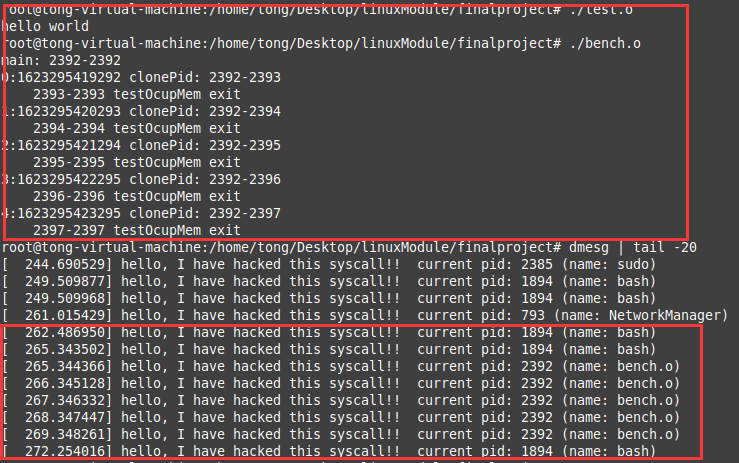

## Final Project：动态修改系统调用

### 实验目的

- 系统调用在内核是如何被调用的。
- 操作系统中的页表是怎么构建的。
- 如何去遍历页表。
- 如何修改页表。
- 各级页表中页表项的各个字段是什么含义。
- 当编写的驱动发生crash和panic时，如何去debug。  

### 实验内容

1. 编写一个内核模块。
   实验环境：ARM64，x86-64均可，Linux 5.0以上内核。

   要求替换系统调用表（sys_call_table) 中某一项系统调用，替换成自己编写的系统调用处理函数（例如`my_syscall()`），在新的系统调用函数中打印一句 `“hello，I have hacked this syscall"`，然后再调用回原来的系统调用处理函数。

   以ioctl系统调用为例，它在系统调用表中的编号是`__NR_ioctl`. 那么需要修改系统调用表`sys_call_table[__NR_ioctl]`的指向，让其指向`my_syscall`函数，然后在`my_syscall()`函数中打印一句话，调用原来的`sys_call_table[__NR_ioctl]`指向的处理函数。

2. 卸载模块时把系统调用表恢复原样。

3. 用clone系统调用来验证你的驱动，clone系统调用号是`__NR_clone` 。

### 实验环境

- Linux Mint 发行版，基于Ubuntu20.04
- Linux内核版本：5.4

### 实验思路&过程

#### 分析

通过助教给出的实验内容以及指导说明，需要通过编写内核模块重新映射系统调用地址以实现动态修改系统调用函数内容。很容易看出两部分关键内容：获取系统调用表的地址、编写自己的系统调用处理函数。在实践过程中，通过查资料，我得知另一部分重要部分是在修改调用表时需要关闭其写保护。所以此次实验关键部分有三块，我将依次分析。

1. 寻找系统调用表内存地址
   - 系统调用表：在 Linux 系统中，每个系统调用都有相应的系统调用号作为唯一的标识，内核维护一张系统调用表：`sys_call_table`。在 64 位系统中，`sys_call_table` 的定义在 `entry/syscall_64.c`，可以把 `sys_call_table` 看作一个数组，索引为系统调用号，值为系统调用函数的起始地址。
   - 通过网上查资料，获取调用表地址，有多种方法，包括通过 `/boot/System.map `获取、通过 `/proc/kallsyms` 获取、通过遍历内存搜索获取、调用`kallsyms_lookup_name`函数获取。其中前两种方式都是对文件内容进行过滤，而且第一种已经失效。
   - 内存遍历获取调用表起始地址：内核内存空间的起始地址 `PAGE_OFFSET` 变量和 `sys_close` 系统调用在内核模块中是可见的。系统调用号在同一ABI（x86与x64属于不同ABI）中是高度后向兼容的，可以直接引用（如 `__NR_close` ）。我们可以从内核空间起始地址开始，把每一个指针大小的内存假设成 `sys_call_table` 的地址，并用 `__NR_close` 索引去访问它的成员，如果这个值与 `sys_close` 的地址相同的话，就可以认为找到了 `sys_call_table` 的地址。在内核版本5.3之后`sys_close`被更换为`ksys_close`，这点需要注意。
   - `kallsyms_lookup_name`是最简单的一种方法，只需要调用该函数，参数为`sys_call_table`即可返回系统调用表的起始位置，非常方便，本次也使用这种方式进行系统调用表的获取。
2. 自定义系统调用函数
   - 自定义的系统调用函数需要覆盖原有的系统调用函数，且需要保证正常调用能够运行，所以需要在自定义系统调用函数中调用原有的系统调用函数。
   - 查看所拦截的系统调用函数的参数，并依照其设置自定义调用函数的参数。
3. 关闭与开启写保护
   - `CR0 `是系统内的控制寄存器之一。控制寄存器是一些特殊的寄存器，它们可以控制CPU的一些重要特性。 `CR0`的第16位是写保护未即WP位(486系列之后)，只要将这一位置0就可以禁用写保护，置1则可将其恢复。
   - 系统不允许修改系统调用表，在内存中设置了写保护，可以通过修改CR0寄存器的第16位进行禁用写保护。
   - Linux 内核提供的接口 `set_bit `和 `clear_bit `来操作比特。`Linux5.0`上直接调用`write_cr0`接口，能够顺利的写入`CR0`寄存器，而内核版本更新到`Linux5.3`以后,对`CR0`的修改进行了保护，所以这里需要自定义`write_cr0`的实现，直接从`Linux5.0`中把相关代码静态编译进入模块中。这样也可以绕过对`CR0`的保护。

#### 实现

根据上一部分的分析进行代码的编写与运行。

1. 获取系统调用表起始地址

   ```c
   unsigned long *call_table = kallsyms_lookup_name("sys_call_table");
   ```

2. 自定义系统调用函数

   ```c
   asmlinkage long my_syscall(unsigned long para1,
                            unsigned long para2,
                            int __user *para3,
                            int __user *para4,
                            unsigned long para5)
   {
       long return_val = anything_saved(para1, para2, para3, para4, para5);
       printk(KERN_INFO "hello, I have hacked this syscall!!  current pid: %d (name: %s)", current->pid, current->comm);
       return return_val;
   }
   ```

   

3. 关闭与开启写保护

   ```
   static unsigned long __lkm_order;
   static inline unsigned long lkm_read_cr0(void)
   {
       unsigned long val;
       asm volatile("mov %%cr0,%0\n\t"
                    : "=r"(val), "=m"(__lkm_order));
       return val;
   }
   static inline void lkm_write_cr0(unsigned long val)
   {
       asm volatile("mov %0,%%cr0"
                    :
                    : "r"(val), "m"(__lkm_order));
   }
   // 关闭写保护
   void disable_write_protection(void)
   {
       unsigned long cr0 = lkm_read_cr0();
       clear_bit(16, &cr0);
       lkm_write_cr0(cr0);
   }
   // 开启写保护
   void enable_write_protection(void)
   {
       unsigned long cr0 = lkm_read_cr0();
       set_bit(16, &cr0);
       lkm_write_cr0(cr0);
   }
   ```

4. 重新映射系统调用表的相应索引的值

   ```c
   #define syscall_num __NR_clone
   // 用于保存被劫持的系统调用
   static long (*anything_saved)(unsigned long, unsigned long, int __user *,
                                 int __user *, unsigned long);	
   	// 关闭写保护
       disable_write_protection();
       // 得到系统调用表地址
       sys_call_table = get_sys_call_table();
       printk(KERN_INFO "syscall table address: %px\n", sys_call_table);
       // 保存系统调用的地址
       anything_saved = sys_call_table[syscall_num];
       // 将系统调用更改为为自定义函数
       sys_call_table[syscall_num] = (unsigned long)my_syscall;
       // 开启写保护
       enable_write_protection();
   ```

5. 恢复原有的系统调用函数

   ```c
   	// 关闭写保护
       disable_write_protection();
       // 恢复系统调用
       sys_call_table[syscall_num] = (unsigned long)anything_saved;
       // 开启写保护
       enable_write_protection();
   ```

#### 模块编译

使用make编译

`Makefile`文件内容：

```makefile
obj-m:=hack_syscall.o
KDIR:=/lib/modules/$(shell uname -r)/build/
PWD:=$(shell pwd)
all:
	make -C $(KDIR) M=$(PWD) modules
clean:
	make -C $(KDIR) M=$(PWD) clean
```

### 效果展示

依次运行以下命令：

```bash
insmod hack_syscall.ko
./test.o
./bench.o
dmesg | tail -25
rmmod hack_syscall.ko
```

加载模块，运行助教提供的两个测试程序，然后观察内核输出信息，如下图：



可以看到想要的效果均已实现。

### 收获&感想

这次的大作业是实现系统调用的动态修改，在这个过程中，我巩固了课上所学的相关系统调用的知识，对劫持系统调用以及相关的调用表替换有了一定了解，最后顺利完成了实验任务。

由于获取系统调用表有多种途径，而且在X86机器上Linux提供了相关的接口函数，所以在这一步我并没有卡太久，整个实验也就显得比较容易，之后有时间的话，我想尝试通过遍历内存来获取系统调用表的起始地址。

感谢助教和老师的帮助！