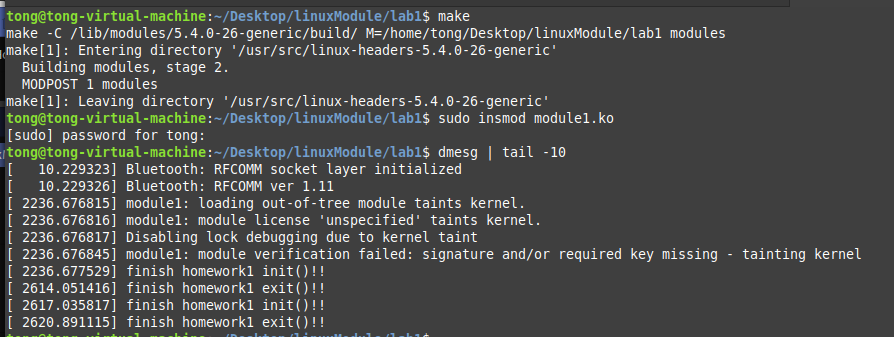
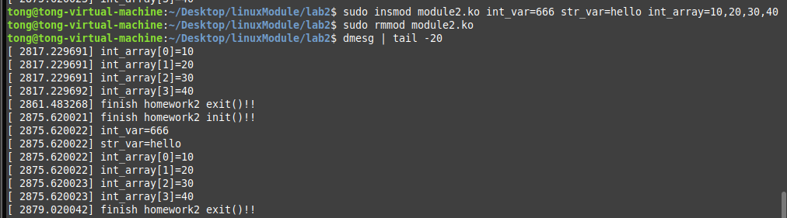
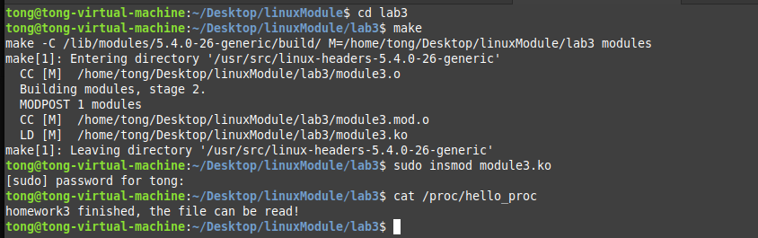
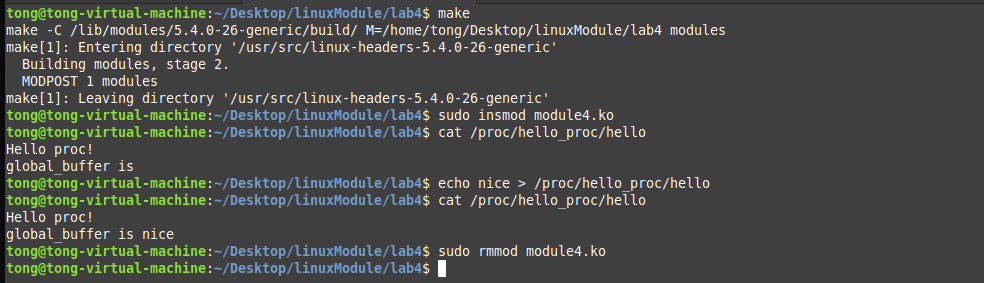

## 实验报告

### 实验要求

1. 模块一，加载和卸载模块时在系统日志输出信息。
2. 模块二，支持整型、字符串、数组参数，加载时读入并打印。
3. 模块三，在/proc下创建只读文件。
4. 模块四，在/proc下创建文件夹，并创建一个可读可写的文件。

### 实验过程

##### 模块一

1. 参考老师上课所讲源代码，写出以下源代码，并编译运行。

   ```c
   #include <linux/kernel.h>
   #include <linux/module.h>
   #include <linux/init.h>
   static int __init homework1_init(void)
   {
   printk(KERN_INFO "finish homework1 init()!!");//加载模块输出信息
   return 0;
   }
   static void __exit homework1_exit(void)
   {
   printk(KERN_INFO "finish homework1 exit()!!");//卸载模块输出信息
   printk(KERN_INFO "");
   }
   
   module_init(homework1_init);
   module_exit(homework1_exit);
   ```

##### 模块二

1. 助教已经在实验指导中讲解module_param函数，使用这个函数来读取整型和字符串。

2. 上网查找，可以使用module_param_array函数实现数组的读取。

3. 根据以上两点，写出主要源代码如下:

   ```C
   #define MAX_SIZE 10
   static int int_var = 2020;//定义默认整型值
   static char *str_var = "tongzhixin";//定义默认字符串值
   static int int_array[MAX_SIZE] = {};//用来保存读入的整型数组
   static int n_para = 10;//参数的个数
   module_param(int_var,int,S_IRUGO);
   module_param(str_var,charp,S_IRUGO);
   module_param_array(int_array,int,&n_para,S_IRUGO);
   static int __init homework2_init(void)
   {
   int i;
   printk(KERN_INFO "finish homework2 init()!!");
   printk(KERN_INFO "int_var=%d",int_var);//输出整型的值
   printk(KERN_INFO "str_var=%s",str_var);//输出字符串的值
   for (i=0;i<n_para;i++)
   {
   printk(KERN_INFO "int_array[%d]=%d",i,int_array[i]);//循环输出数组的值
   }
   return 0;
   }
   static void __exit homework2_exit(void)
   {
   printk(KERN_INFO "finish homework2 exit()!!");
   }
   
   module_init(homework2_init);
   module_exit(homework2_exit);
   ```

#####  模块三

1. 老师上课所讲的创建proc文件的函数已经过时，助教在实验指导中给出了目前采用的方式。

2. 上网查资料了解相关proc文件系统读取的方式，看到了seq_file文件操作方式，看着很方便，于是采用这种方式。

3. 实验小插曲：由于当时我使用manjaro发行版，内核较新，不再支持file_operations结构体，而是转为支持proc_ops结构体，按照网上的方式，更改完成就没有问题了，但是我仍然采用了5.6版本以前的方式，也就是助教提供的方法。

4. 写出以下源代码与解释：

   ```c
   static struct proc_dir_entry *entry;
   // 被调用时输出信息流
   static int hello_proc_show(struct seq_file *m, void *v) {
     seq_printf(m, "homework3 finished, the file can be read!\n");
     return 0;
   }
   // 打开文件读取时首先调用此函数
   static int hello_proc_open(struct inode *inode, struct  file *file) {
     return single_open(file, hello_proc_show, NULL);
   }
   // 定义结构体
   static const struct file_operations fops={
       .owner =THIS_MODULE,
       .read = seq_read,
       .open = hello_proc_open,
   };
   static int __init homework3_init(void)
   {
       printk(KERN_INFO "homework3 init()!!");
       // 返回创建文件的句柄
       entry = proc_create("hello_proc",0444,NULL,&fops);
       // 定义创建成功与否之后的操作
       if(!entry)
       return -1;
       else{
           printk(KERN_INFO "create successfully!\n");
           return 0;
       } 
   }
   static void __exit homework3_exit(void)
   {
     printk(KERN_INFO "finish homework3 exit()!!");
     remove_proc_entry("hello_proc", NULL);
     
   }
   module_init(homework3_init);
   module_exit(homework3_exit);
   ```

##### 模块四

1. 模块四是模块三的进阶版，多了一个创建文件夹以及写操作。

2. 创建全局的字符串数组用于保存输入缓冲区内容，以便送入输出的缓冲区，而且不用手动释放内容。

3. 取字符串输入长度与已定义字符串数组长度的最小值，避免溢出。

4. 根据模块三以及前面的分析，写出以下主要代码：

   ```c
   #define BUF_SIZE 100
   char global_buffer[BUF_SIZE]; //创建全局数组
   #define BASE_DIR_NAME  "hello_proc" // 定义文件夹名称
   #define FILE_NAME "hello" // 定义文件名称
   static struct proc_dir_entry *file_entry; // 文件句柄
   static struct proc_dir_entry *dir_entry;// 文件夹句柄
   
   static int hello_proc_show(struct seq_file *m, void *v) {
     seq_printf(m, "Hello proc!\n");
     seq_printf(m, "global_buffer is %s\n", global_buffer);// 展示写入的内容
     return 0;
   }
   
   static int hello_proc_open(struct inode *inode, struct  file *file) {
     return single_open(file, hello_proc_show, NULL);
   }
   // write函数
   static ssize_t hello_proc_write(struct file *file, const char __user *buffer, size_t count, loff_t *f_pos){
     int len;
     if(count<BUF_SIZE)len=count; // 比较大小，取小的一个
     else len = BUF_SIZE;
     copy_from_user(global_buffer, buffer, len);// 将写入的缓冲区内容拷贝给global_buffer
     global_buffer[len-1]='\0'; // 增加结束符号
     return len;
   }
   static const struct file_operations fops={
       .owner =THIS_MODULE,
       .read = seq_read,
       .open = hello_proc_open,
       .write = hello_proc_write,
       .llseek = seq_lseek,
       .release = single_release,
   };
   
   static int __init homework4_init(void)
   {
       printk(KERN_INFO "homework4 init()!!");
       dir_entry = proc_mkdir(BASE_DIR_NAME, NULL);
       // 文件夹创建
       if(!dir_entry){
         printk(KERN_INFO "proc create %s dir failed\n", BASE_DIR_NAME);
         return -1;
       }
       // 文件创建
       file_entry = proc_create(FILE_NAME, 0777, dir_entry, &fops);
       if(!file_entry)
       return -1;
       else{
         printk(KERN_INFO "created!");
         return 0;
       } 
   } 
   static void __exit homework4_exit(void)
   {
     printk(KERN_INFO "finish homework4 exit()!!");
     // 退出之后要移除相应的文件，否则在正常文件系统中无法移除
     remove_proc_entry(FILE_NAME, dir_entry);
     remove_proc_entry(BASE_DIR_NAME,NULL);
   }
   module_init(homework4_init);
   module_exit(homework4_exit);
   ```


### 实验效果截图

##### 模块一



##### 模块二



##### 模块三



##### 模块四



### 实验心得

这次实验主要了解proc文件系统，以及内核模块编程的基础知识，难度并不是很大，思路什么的助教和老师也说的很明白了。中间由于内核版本的问题遇到了一些错误比如proc_ops结构体，幸好及时使用搜索引擎解决了。

实验最终是在Linux Mint发行版本进行模拟和操作，内核版本为5.4.0。