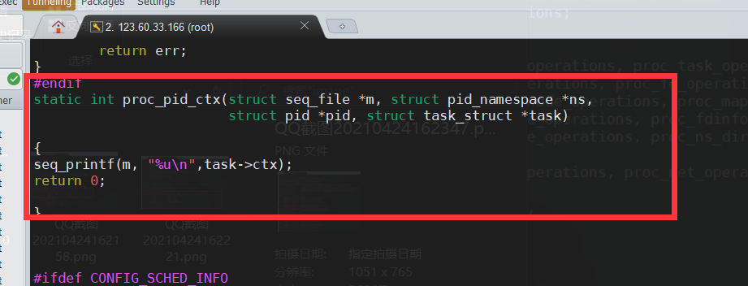

## 实验二 进程管理

### 实验内容

1. 为` task_struct` 结构添加数据成员` int ctx` ，每当进程被调用一次，`ctx++`。
2. 把`ctx`输出到` /proc/<PID>/ctx `下，通过` cat /proc/<PID>/ctx` 可以查看当前指定进程的`ctx`的值。  

### 实验思路&过程

1. 由于进程是通过进程控制块进行管理，所以有一个`task_struct`结构体，用来储存进程信息，所以只需在其中添加`ctx`数据成员，就能在每一个进程中设置和更改`ctx` 。该结构体在`include/linux/sched.h  `中被定义。

   ##### 过程截图：

   

2. 进程的创建，源码文件为：`kernel/fork.c  `，其中有`copy_process`函数，用来以当前进程为副本进行内容的复制并返回一个`task_struct`指针，只需要对要返回的指针进行 `ctx`初始化即可。我这里是通过在`copy_process`内部进行初始化，也可以在该函数被调用时所在函数进行初始化，可以多做一些判断的逻辑。

   ##### 过程截图：

   

   

3.  进程调度时有专门的调度函数，通过调度算法，找到应该被调度的那个进程。所以只需要在被调度时，改变`ctx`的值即可。这里是在`kernel/sched/core.c  `中进行更改。`pick_next_task`函数为调度函数，在返回一个进程指针后，将其存储的`ctx`数据成员自增。

   ##### 过程截图：

   

   

4.  在`/proc/<PID>/`下创建`ctx`目录并保存信息，源码文件位于`fs/proc/base.c  `，参考此目录下的limits等数据成员的展示，选择`ONE`进行创建，并自定义读取函数，这个函数之前在模块编程实验中有了解。

   ##### 过程截图：

   其中前两张是源码中已有的，在更改过程中被参考的重要部分。后两张是更改部分。

   

   

   

   
   
5.  然后重新按照指导书上面的编译安装内核即可。

### 实验结果展示

运行测试程序

输入值，`ctx` 会自增

查看相关进程号，并查看proc内容

### 收获&感想

- 阅读源码的能力得到锻炼，以前读的代码没有这么猛
- 对进程创建以及调度有了更深的理解，对`linux`内核源码的结构有了一定的理解
- 更加熟悉`vim`操作，搜索功能太好用了
- 助教给的实验指导很是详尽，给我很大帮助
- proc文件系统确实复杂，我第一次编译的时候没有出现想要的结果，咨询别人后，才发现原来是`seq_printf`函数后面一定要加上`m`这个参数的，这点给我了我很深的印象，以后还是要多尝试，也要多与同学们交流，更快发现问题，减少不必要的焦虑
- 感谢身边同学的帮助以及助教的实验指导书

