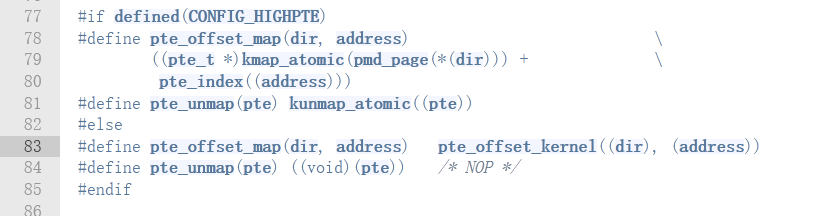
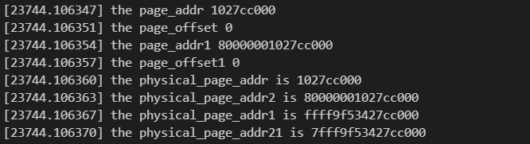

## 实验三 内存管理

### 实验内容

写一个模块`mtest`，当模块加载时，创建一个proc文件` /proc/mtest`，该文件接收三种类型的参数，具体如下：

- `listvma` 打印当前进程的所有虚拟内存地址，打印格式为` start-addr end-addr permission`
- `findpage addr` 把当前进程的虚拟地址转化为物理地址并打印，如果不存在这样的翻译，则输出`translation not found`
- `writeval addr val `向当前地址的指定虚拟地址中写入一个值。
  注：所有输出可以用 `printk `来完成，通过 `dmesg `命令查看即可。  

### 实验思路&过程

#### 分析

整个实验可以分为四部分内容：

- 创建proc文件并收集写入的内容，作为之后触发函数的条件
- 打印当前进程的所有虚拟地址
- 将虚拟地址转化为物理地址
- 向虚拟地址中写入一个值

#### 实现

##### proc收集条件

- 参考之前的实验，创建`mtest`文件；

- 每当向文件中写入时，会触发自定义的函数`mtest_proc_write；`；

- 使用linux 封装好的字符串处理函数`strsep`，对缓冲区中的字符串做切割，由于该函数会对指针指向的字符串做出改变，所以要对该字符串进行拷贝；

  ```c
  	// tmp_buffer即是拷贝出来的缓冲区中写入的字符串
  	copy_from_user(global_buffer, buffer, len);
      global_buffer[len - 1] = ' ';
      global_buffer[len] = '\0';
      char tmp_buffer[BUF_SIZE];
      char *iter = tmp_buffer;
      char delim[] = " ";
      char *token, *cur = strcpy(iter, global_buffer);
      token = strsep(&cur, delim);
  ```

- 对切割出来的字符串进行判断，进行相应的处理；

##### 打印当前进程虚拟地址

- 首先，对`mm_types.h`以及`task_struct`相关的头文件进行针对性浏览，找到相关的数据结构，如图：

  

  

  

  

-  可以找到`task_struct->mm_struct->vm_area_struct`这样的一个指向链，利用`mmap`这个链表进行遍历；如果担心过程内存发生变动，可以加上锁；

  ```c
   for (vma = p->mm->mmap; vma; vma = vma->vm_next)
  ```

- 每个虚拟地址块有相应的标志位，标志位定义在mm.h头文件中

  

##### 将虚拟地址转化为物理地址

- 由课上以及课外了解到，用户态的虚拟地址可由页表机制进行翻译为物理地址，内核态虚拟地址可由线性机制翻译为物理地址，也可以进行相反的转化；

- 对相关头文件进行分析可知，目前的`linux`内核包含5级页表，分别为`pgd_t 、p4d_t、 pud_t 、  pmd_t、   pte_t`；

- 到达pte页框后，还要将其转化为`page`的物理地址，然后与虚拟地址的偏移量一起组成物理地址；

- 撰写代码，关键函数：`page_to_phys`

  ```c
  	struct mm_struct *mm;
      struct task_struct *p;
      unsigned long physical_page_addr;
      unsigned long physical_page_addr1;
      unsigned long page_addr = 0;
      unsigned long page_offset = 0;
      p = current;
      mm = p->mm;
      pgd_t *pgd;
      p4d_t *p4d;
      pud_t *pud;
      pmd_t *pmd;
      pte_t *pte;
      struct page *page;
      pgd = pgd_offset(mm, addr);
      if (pgd_none(*pgd) || pgd_bad(*pgd))
      {
          printk(KERN_INFO "5 level error \n");
          printk(KERN_INFO "translation not found \n");
          return 0;
      }
      p4d = p4d_offset(pgd, addr);
      if (p4d_none(*p4d) || p4d_bad(*p4d))
      {
          printk(KERN_INFO "4 level error \n");
          printk(KERN_INFO "translation not found \n");
          return 0;
      }
      pud = pud_offset(p4d, addr);
      if (pud_none(*pud) || pud_bad(*pud))
      {
          printk(KERN_INFO "3 level error \n");
          printk(KERN_INFO "translation not found \n");
          return 0;
      }
      pmd = pmd_offset(pud, addr);
      if (pmd_none(*pmd) || pmd_bad(*pmd))
      {
          printk(KERN_INFO "2 level error \n");
          printk(KERN_INFO "translation not found \n");
          return 0;
      }
      if (!(pte = pte_offset_kernel(pmd, addr)))
      {
          printk(KERN_INFO "1 level error \n");
          printk(KERN_INFO "translation not found \n");
          return 0;
      }
      if (!(page = pte_page(*pte))){
          printk(KERN_INFO "translation not found \n");
          return 0;
      }
  
      page_addr = page_to_phys(page) & PAGE_MASK;
      page_offset = addr & ~PAGE_MASK;
      //printk(KERN_INFO "the page_addr %lx \n", page_addr);
      //printk(KERN_INFO "the page_offset %lx \n", page_offset);
      physical_page_addr = page_addr | page_offset;
      physical_page_addr1 = phys_to_virt(physical_page_addr);
      printk(KERN_INFO "the physical_page_addr is 0x%lx \n", physical_page_addr);
      printk(KERN_INFO "the kernel addr is 0x%lx \n", physical_page_addr1);
      return physical_page_addr;
  ```

##### 向虚拟地址中写入值

- 此项需要借助前一项的函数接口，进行虚拟地址至物理地址的转化；
- 需要先找到相应虚拟块，判断权限；
- 然后将物理地址转为内核态的虚拟地址，让内核态来进行值的写入；

- 代码，关键函数：`phys_to_virt`

  ```c
  static void mtest_write_val(unsigned long addr, unsigned long val)
  {
      struct mm_struct *mm;
      struct vm_area_struct *vma;
      struct task_struct *p;
      p = current;
      mm = p->mm;
      down_read(&mm->mmap_sem);
      if (!p->mm->mmap)
      {
          printk(KERN_ALERT "the process is %s nommap \n", p->comm);
          up_read(&mm->mmap_sem);
          return;
      }
      for (vma = p->mm->mmap; vma; vma = vma->vm_next)
      {
          printk(KERN_INFO "0x%lx - 0x%lx   ", vma->vm_start, vma->vm_end);
          if (addr < vma->vm_end && addr >= vma->vm_start)
          {
              if (vma->vm_flags & VM_WRITE)
              {
                  unsigned long physical_page_addr = mtest_find_page(addr);
                  up_read(&mm->mmap_sem);
                  unsigned long *tmp_val;
                  tmp_val = phys_to_virt(physical_page_addr);
                  *tmp_val = val;
                  printk(KERN_INFO "tmp_val is %lx \n ", *tmp_val);
                  printk(KERN_INFO "\n ");
                  return;
              }
              else
              {
                  up_read(&mm->mmap_sem);
                  printk(KERN_INFO "can not write \n");
                  return;
              }
          }
      }
      up_read(&mm->mmap_sem);
      printk(KERN_INFO "can not find the address! \n");
  }
  ```

#### 运行命令进行测试

### 实验结果展示


### 收获&感想

这次内核编程实验，我完成了相关任务，对内存的地址机制有了比较深的理解。这次试验我花费了比较长的时间，主要由于开始的时候有些盲目，不太清楚内核态与用户态的虚拟地址与硬件地址的切换机制，查资料也没有查对方向，后来才明白过来。查了很多资料，也更清楚知道了32位机器与64位机器内存地址机制的区别。但也仍然有一些疑问没有解决，我写在了下文中。

##### tips & questions

- 内核地址空间采用线性映射和页表转换，一定会有线性映射，但是映射后一般会建立相应的页表映射。

- 获取内核态的虚拟地址，只需要将相应物理地址使用`phys_to_vir`即可获取对应的虚拟地址，也可以先获取相应page的虚拟地址(使用`page_address()`函数)，然后与page_offset进行`|`运算。

- 获取物理硬件地址：如果虚拟地址是内核态，直接`vir_to_phys`即可，如果虚拟地址用户态，则需要进行针对性的页表转换，获取到page，然后通过`page_to_phys(page)`函数获取物理地址，然后进行与或操作。

  ```
  page_addr = page_to_phys(page) & PAGE_MASK;
  page_offset = addr & ~PAGE_MASK;
  ```

- pte_offset_map与pte_offset_kernel的区别主要在于

  

- 疑问：使用`pte_val(*pte)`获取页表框，与`pte_page(*pte)`效果不相同，使用`pte_page`能够获得正确的`page`，并且使用`page`获取物理地址。下文是我写的相关的对比代码，以及输出截图。

  ```c
  if (!(pte = pte_offset_kernel(pmd, addr)))
      {
          printk(KERN_INFO "1 level error \n");
          return 0;
      }
      if (!(page = pte_page(*pte)))
          return 0;
  
      page_addr = page_to_phys(page) & PAGE_MASK;
      page_offset = addr & ~PAGE_MASK;
      printk(KERN_INFO "the page_addr %lx \n", page_addr);
      printk(KERN_INFO "the page_offset %lx \n", page_offset);
      physical_page_addr = page_addr | page_offset;
      physical_page_addr1 = phys_to_virt(physical_page_addr);
  
      unsigned long physical_page_addr2;
      unsigned long physical_page_addr21;
      page_addr1 = pte_val(*pte) & PAGE_MASK;
      page_offset1 = addr & ~PAGE_MASK;
      printk(KERN_INFO "the page_addr1 %lx \n", page_addr1);
      printk(KERN_INFO "the page_offset1 %lx \n", page_offset1);
      physical_page_addr2 = page_addr1 | page_offset1;
      physical_page_addr21 = phys_to_virt(physical_page_addr2);
  
      printk(KERN_INFO "the physical_page_addr is %lx \n", physical_page_addr);
      printk(KERN_INFO "the physical_page_addr2 is %lx \n", physical_page_addr2);
      printk(KERN_INFO "the physical_page_addr1 is %lx \n", physical_page_addr1);
      printk(KERN_INFO "the physical_page_addr21 is %lx \n", physical_page_addr21);
  
  ```

  

  

### 附录

##### 代码

```c
#include <linux/kernel.h>
#include <linux/module.h>
#include <linux/init.h>
#include <linux/string.h>       // 字符串操作
#include <linux/sched/signal.h> // for each process宏
#include <linux/proc_fs.h>
#include <linux/seq_file.h>
#include <linux/uaccess.h> // for copy_from_user

#include <linux/mm_types.h> //vma
#include <linux/mm.h>

#define FILE_NAME "mtest"
#define BUF_SIZE 100
char global_buffer[BUF_SIZE];
static struct proc_dir_entry *entry;
/*Print all vma of the current process*/
static void mtest_list_vma(void)
{
    struct mm_struct *mm;
    struct vm_area_struct *vma;
    struct task_struct *p;
    p = current;
    printk(KERN_ALERT "the process is \"%s\" (pid %i),and process status is  %i \n", p->comm, p->pid, p->flags);
    if (!p->mm)
    {
        printk(KERN_ALERT "the process is \"%s\" (pid %i),and process status is  %i,没有mm数据 \n", p->comm, p->pid, p->flags);
    }
    mm = p->mm;
    down_read(&mm->mmap_sem);
    if (!p->mm->mmap)
    {
        printk(KERN_ALERT "the process is \"%s\" (pid %i),and process status is  %i,no mmap \n", p->comm, p->pid, p->flags);
        up_read(&mm->mmap_sem);
    }
    for (vma = p->mm->mmap; vma; vma = vma->vm_next)
    {
        printk(KERN_INFO "0x%lx - 0x%lx ", vma->vm_start, vma->vm_end);
        if (vma->vm_flags & VM_READ)
        {
            printk(KERN_INFO "r");
        }
        else
        {
            printk(KERN_INFO "-");
        }

        if (vma->vm_flags & VM_WRITE)
        {
            printk(KERN_INFO "w");
        }
        else
        {
            printk(KERN_INFO "-");
        }

        if (vma->vm_flags & VM_EXEC)
        {
            printk(KERN_INFO "x");
        }
        else
        {
            printk(KERN_INFO "-");
        }

        if (vma->vm_flags & VM_SHARED)
        {
            printk(KERN_INFO "s");
        }
        else
        {
            printk(KERN_INFO "p");
        }
        printk(KERN_INFO "\n");
    }
    up_read(&mm->mmap_sem);
}
/*Find va->pa translation */
static unsigned long mtest_find_page(unsigned long addr)
{
    struct mm_struct *mm;
    struct task_struct *p;
    unsigned long physical_page_addr;
    unsigned long physical_page_addr1;
    unsigned long page_addr = 0;
    unsigned long page_offset = 0;
    p = current;
    mm = p->mm;
    pgd_t *pgd;
    p4d_t *p4d;
    pud_t *pud;
    pmd_t *pmd;
    pte_t *pte;
    struct page *page;
    pgd = pgd_offset(mm, addr);
    if (pgd_none(*pgd) || pgd_bad(*pgd))
    {
        printk(KERN_INFO "5 level error \n");
        printk(KERN_INFO "translation not found \n");
        return 0;
    }
    p4d = p4d_offset(pgd, addr);
    if (p4d_none(*p4d) || p4d_bad(*p4d))
    {
        printk(KERN_INFO "4 level error \n");
        printk(KERN_INFO "translation not found \n");
        return 0;
    }
    pud = pud_offset(p4d, addr);
    if (pud_none(*pud) || pud_bad(*pud))
    {
        printk(KERN_INFO "3 level error \n");
        printk(KERN_INFO "translation not found \n");
        return 0;
    }
    pmd = pmd_offset(pud, addr);
    if (pmd_none(*pmd) || pmd_bad(*pmd))
    {
        printk(KERN_INFO "2 level error \n");
        printk(KERN_INFO "translation not found \n");
        return 0;
    }
    if (!(pte = pte_offset_kernel(pmd, addr)))
    {
        printk(KERN_INFO "1 level error \n");
        printk(KERN_INFO "translation not found \n");
        return 0;
    }
    if (!(page = pte_page(*pte))){
        printk(KERN_INFO "translation not found \n");
        return 0;
    }


    page_addr = page_to_phys(page) & PAGE_MASK;
    page_offset = addr & ~PAGE_MASK;
    //printk(KERN_INFO "the page_addr %lx \n", page_addr);
    //printk(KERN_INFO "the page_offset %lx \n", page_offset);
    physical_page_addr = page_addr | page_offset;
    physical_page_addr1 = phys_to_virt(physical_page_addr);
    printk(KERN_INFO "the physical_page_addr is 0x%lx \n", physical_page_addr);
    printk(KERN_INFO "the kernel addr is 0x%lx \n", physical_page_addr1);
    return physical_page_addr;
}
/*Write val to the specified address */
static void mtest_write_val(unsigned long addr, unsigned long val)
{
    struct mm_struct *mm;
    struct vm_area_struct *vma;
    struct task_struct *p;
    p = current;
    mm = p->mm;
    down_read(&mm->mmap_sem);
    if (!p->mm->mmap)
    {
        printk(KERN_ALERT "the process is %s nommap \n", p->comm);
        up_read(&mm->mmap_sem);
        return;
    }
    for (vma = p->mm->mmap; vma; vma = vma->vm_next)
    {
        printk(KERN_INFO "0x%lx - 0x%lx   ", vma->vm_start, vma->vm_end);
        if (addr < vma->vm_end && addr >= vma->vm_start)
        {
            if (vma->vm_flags & VM_WRITE)
            {
                unsigned long physical_page_addr = mtest_find_page(addr);
                up_read(&mm->mmap_sem);
                unsigned long *tmp_val;
                tmp_val = phys_to_virt(physical_page_addr);
                *tmp_val = val;
                printk(KERN_INFO "tmp_val is %lx \n ", *tmp_val);
                printk(KERN_INFO "\n ");
                return;
            }
            else
            {
                up_read(&mm->mmap_sem);
                printk(KERN_INFO "can not write \n");
                return;
            }
        }
    }
    up_read(&mm->mmap_sem);
    printk(KERN_INFO "can not find the address! \n");
}
static ssize_t mtest_proc_write(struct file *file,
                                const char __user *buffer,
                                size_t count, loff_t *data)
{
    int len;
    if (count < BUF_SIZE)
        len = count;
    else
        len = BUF_SIZE;
    copy_from_user(global_buffer, buffer, len);
    global_buffer[len - 1] = ' ';
    global_buffer[len] = '\0';
    char tmp_buffer[BUF_SIZE];
    char *iter = tmp_buffer;
    char delim[] = " ";
    char *token, *cur = strcpy(iter, global_buffer);
    token = strsep(&cur, delim);
    if (strcmp(token, "listvma") == 0)
    {
        mtest_list_vma();
    }
    else if (strcmp(token, "findpage") == 0)
    {
        unsigned long addr;
        while (token = strsep(&cur, delim))
        {
            if (strcmp(token, "") == 0)
                continue;
            kstrtoul(token, 0, &addr);
            break;
        }
        mtest_find_page(addr);
    }
    else if (strcmp(token, "writeval") == 0)
    {
        unsigned long addr;
        unsigned long val;
        int count = 0;
        while (token = strsep(&cur, delim))
        {
            if (strcmp(token, "") == 0)
                continue;
            if (count == 2)
                continue;
            if (count == 0)
            {
                kstrtoul(token, 0, &addr);
                ++count;
            }
            else if (count == 1)
            {
                kstrtoul(token, 0, &val);
                ++count;
            }
        }
        mtest_write_val(addr, val);
    }
    return len + 1;
}
static struct file_operations proc_mtest_operations = {
    .write = mtest_proc_write};
static struct proc_dir_entry *mtest_proc_entry;
static int __init mtest_init(void)
{
    printk(KERN_INFO "mtest init ! \n");
    entry = proc_create(FILE_NAME, 0777, NULL, &proc_mtest_operations);
    if (!entry)
        return -1;
    else
    {
        printk(KERN_INFO "create file successfully!\n");
        return 0;
    }
}
static void __exit mtest_exit(void)
{
    printk(KERN_INFO "mtest exit ! \n");
    remove_proc_entry(FILE_NAME, NULL);
}
module_init(mtest_init);
module_exit(mtest_exit);
MODULE_LICENSE("GPL");
```

##### 参考链接：

1. https://zhuanlan.zhihu.com/p/146477822
2. http://faculty.washington.edu/wlloyd/courses/tcss422_f2018/assignments/TCSS422_f2018_A3.pdf
3. https://www.cnblogs.com/alantu2018/p/8459336.html
4. https://github.com/ljrcore/linuxmooc/blob/master/%E7%B2%BE%E5%BD%A9%E6%96%87%E7%AB%A0/%E6%96%B0%E6%89%8B%E4%B8%8A%E8%B7%AF%EF%BC%9ALinux%E5%86%85%E6%A0%B8%E4%B9%8B%E6%B5%85%E8%B0%88%E5%86%85%E5%AD%98%E5%AF%BB%E5%9D%80.md
5. https://www.cnblogs.com/emperor_zark/archive/2013/03/15/linux_page_1.html
6. https://blog.csdn.net/u013920085/article/details/50856217
7. https://zhuanlan.zhihu.com/p/66794639

