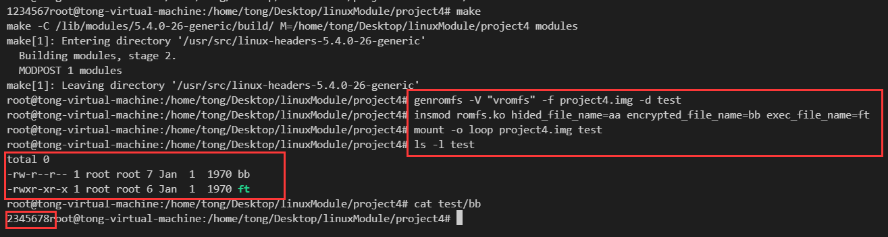

## 实验四 文件系统

### 实验内容

以Linux内核中`/fs/romfs`作为文件系统源码修改的基础，实现以下功能：`romfs.ko` 模块接受三种参数： `hided_file_name` , `encrypted_file_name` , 和 `exec_file_name` 。

- `hided_file_name=xxx` ，隐藏名字为`xxx`的文件/路径。
- `encrypted_file_name=xxx` ，加密名字为`xxx`的文件中的内容。
- `exec_file_name` ， 修改名字为`xxx`的文件的权限为可执行。

上述功能通过生成并挂载一个格式为`romfs`的镜像文件`test.img`来检查，镜像文件可通过`genromfs`来生成。  

### 实验环境

- Linux Mint 发行版，基于Ubuntu20.04
- Linux内核版本：5.4

### 实验思路&过程

#### 分析

整个实验可以分为三个部分：

- 隐藏特定名字的文件/路径
  - 通过阅读`super.c`源码文件内容，可以发现，`romfs_readdir()`函数是用来读取一个目录的文件到内核空间中，在课上我们学过，Linux文件系统中，目录会储存该目录中的所有文件`inode`，以及其他信息，所以只需要在读取内容的时候跳过该文件即可。
  - 在读取目录下文件的`for`循环中，使用`romfs_dev_strnlen()`函数读取文件名长度，使用`romfs_dev_read()`读取文件名，并赋给`fsname`，那么只需要比较该值与传入的字符串即可。
  - 一旦比较结果相同，则跳过`dir__emit()`读取文件内容函数。
- 加密特定名字的文件内容，可以使用每一个字符加一的方式进行加密
  - 同样阅读该文件，第一个函数`romfs_readpage()`就是用来读取文件内容，我们只需要修改对应文件`buf`缓冲区中的内容即可，系统会调用其他函数读取缓冲区的内容进行显示。
  - 使用file中的结构体`file->f_path.dentry->d_name.name`得到目前文件的名字，并与传入的待加密文件比较即可。
  - 一旦比较结果相同，只需要修改`buf`缓冲区内容即可，此处使用每一个字符加一的方式进行模拟加密。
- 修改特定文件的权限为可执行
  - 阅读文件，可以发现`romfs_lookup()`函数用来观察一个文件`inode`的详细信息。
  - `dentry->d_name.name`获取到当前文件名字，`romfs_iget(dir->i_sb, offset)`获取到当前`inode`。
  - 由上一条，只需要修改`inode`的`i_mode`字段内容即可达到修改文件权限的目的。
  - 所以只需要对比名字，然后修改权限即可。

#### 实现

1. 隐藏文件

   ```c
   j = romfs_dev_strnlen(i->i_sb, offset + ROMFH_SIZE,
   				      sizeof(fsname) - 1);
   		if (j < 0)
   			goto out;
   		ret = romfs_dev_read(i->i_sb, offset + ROMFH_SIZE, fsname, j);
   		if (ret < 0)
   			goto out;
   		fsname[j] = '\0';
   		ino = offset;
   		nextfh = be32_to_cpu(ri.next);
   		// modify
   		if (strcmp(fsname, hided_file_name) == 0){
   			goto skip;
   		}
   		if ((nextfh & ROMFH_TYPE) == ROMFH_HRD)
   			ino = be32_to_cpu(ri.spec);
   		if (!dir_emit(ctx, fsname, j, ino,
   			    romfs_dtype_table[nextfh & ROMFH_TYPE]))
   			goto out;
   // modify
   skip:
   		offset = nextfh & ROMFH_MASK;
   ```

2. 加密文件

   ```c
   // modify
   	char *ptr_buf;
   
   	if (strcmp(file->f_path.dentry->d_name.name, encrypted_file_name) == 0)
   		{
               ptr_buf = (char *)buf;
   			int i = 0;
               for (i = 0; i < fillsize; ++i)
               {
   				*ptr_buf = *ptr_buf + 1;
   				ptr_buf++;
   			}
   		}
   ```

3. 更改文件权限

   ```c
   // modify
   	if (strcmp(exec_file_name, name) == 0){
           inode->i_mode |= S_IXUGO;
       }
   ```

#### 模块编译

基于源码中的`Makefile`，然后结合之前lab中的写法，如下所示:

```makefile
# SPDX-License-Identifier: GPL-2.0
#
# Makefile for the linux RomFS filesystem routines.
#
obj-$(CONFIG_ROMFS_FS) += romfs.o
KDIR:=/lib/modules/$(shell uname -r)/build/
PWD:=$(shell pwd)
romfs-y := storage.o super.o
ifneq ($(CONFIG_MMU),y)
romfs-$(CONFIG_ROMFS_ON_MTD) += mmap-nommu.o
endif

all:
	make -C $(KDIR) M=$(PWD) modules
clean:
	make -C $(KDIR) M=$(PWD) clean
```

### 结果展示

编译加载模块之前：可以看到都是正常的，跟助教的一样。


运行测试命令，加载模块，可以看到想要的效果均已实现。



### 收获&感想

通过这次基于虚拟文件系统的实验，我对课上讲的知识进行了巩固，同时熟悉了真实Linux操作系统种文件管理的数据结构。本次实验总体来说较为简单，只需要阅读少量源代码即可完成实验。感谢助教和老师的帮助！